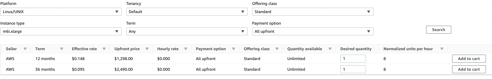

# near-stakewars-iii

## Staking Pool URL:

https://explorer.shardnet.near.org/accounts/shupcode.factory.shardnet.near

## Challenge 1

We need near-cli to issue wallet commands and generate a key for a validator node. Since near-cli is a node program that we can install using npm, let's use a Docker image:

```Docker
#near-cli
FROM node:latest
ARG MONIKER
ARG MYID
RUN groupadd -g ${MYID} ${MONIKER} && useradd -u ${MYID} -g ${MYID} -m ${MONIKER}
USER ${MONIKER}
RUN npm install -g near-cli
WORKDIR /home/${MONIKER}
ENV NEAR_ENV=shardnet
```

Bashing inside the docker container, near commands can be sucessfully used to generate a key or add a key to your near wallet created on the browser

We link my near-cli to my account by doing `near login`:

```
New key added for shupcode.shardnet.near: ed25519:GXRs2sE...
with full access permission
```

https://explorer.shardnet.near.org/transactions/3wq2ENjYKmRgwWfptYNJjBPNtPjSUQJUPn4FbkmqGt5C

## Challenge 2

The guide recommends installing a ton of developer tools but we really only just need a rust Dockerfile with `llvm` and `clang` packages. We also need to take the appropriate commit from the stakwars-iii github repo.

```Docker
#neard image
FROM rust:bullseye
RUN apt update && apt install -y llvm clang jq
#See commit @ https://github.com/near/stakewars-iii/blob/main/commit.md
ARG COMMIT=c1b047b8187accbf6bd16539feb7bb60185bdc38
ARG MONIKER
ARG MYID
RUN groupadd -g ${MYID} ${MONIKER} && useradd -u ${MYID} -g ${MYID} -m ${MONIKER}
USER ${MONIKER}
WORKDIR /home/${MONIKER}
RUN git clone https://github.com/near/nearcore && cd nearcore && git checkout ${COMMIT}
WORKDIR /home/${MONIKER}/nearcore
RUN cargo build -p neard --release --features shardnet
ENV PATH="/home/${MONIKER}/nearcore/target/release:$PATH"
```

Bashing inside this docker container we initialize the config:

```
neard --home ~/.near init --chain-id shardnet --download-genesis
```

We then replace the config with the one recommended:

```
rm ~/.near/config.json
wget -O ~/.near/config.json https://s3-us-west-1.amazonaws.com/build.nearprotocol.com/nearcore-deploy/shardnet/config.json
```

We now need to generate a `validator_key.json` file for the neard image.
In the `near-cli` image, we run `near generate-key shupcode.factory.shardnet.near`
The file created is located at `~/.near-credentials/shardnet/shupcode.factory.shardnet.near.json`

Inside the `neard` image, we `touch ~/.near/validator_key.json` to create the `validator_key.json` file and copy to it the contents of the previous file created above from the `near-cli` image. We also need the change out the json key `private_key` to `secret_key`

```json
{
  "account_id": "shupcode.factory.shardnet.near",
  "public_key": "ed25519:GXRs2sET5RPASHcQPayP4xxDJBS1TWcszyQMrEe2PuwB",
  "secret_key": "ed25519:***"
}
```

## Challenge 3

### creation of staking pool

in the `near-cli` container we run:

```
near call factory.shardnet.near create_staking_pool '{"staking_pool_id": "shupcode", "owner_id": "shupcode.shardnet.near", "stake_public_key": "ed25519:GXRs2sET5RPASHcQPayP4xxDJBS1TWcszyQMrEe2PuwB", "reward_fee_fraction": {"numerator": 5, "denominator": 100}, "code_hash":"DD428g9eqLL8fWUxv8QSpVFzyHi1Qd16P8ephYCTmMSZ"}' --accountId="shupcode.shardnet.near" --amount=30
```

We let shupcode be the owner of the staking pool and use the public key we created in the previous challenge.

We verify the txon the explorer:
https://explorer.shardnet.near.org/transactions/DTKCPfcBQzNfKZwGFboXjW6Ly38tUVSyJNStyXB1eXe5

The successful receipt:

```
SuccessReceiptId:
8DpeLXXbakpYf3x3bd3JgrQf9rLp5YsgQ9upQb3VVv9p
The staking pool @shupcode.factory.shardnet.near was successfully created. Whitelisting...
```

### staking

In the `near-cli` image we need to stake the amount of NEAR in `shupcode.shardnet.near` to `factory.shupcode.shardnet.near`:

```
near call shupcode.factory.shardnet.near deposit_and_stake --amount 528 --accountId shupcode.shardnet.near
```

We verify the tx on the explorer:
https://explorer.shardnet.near.org/transactions/5kGYB1D6B7E2EKns45u6bA8jogA3iug4oRv18WWqhBXh

The successful receipt:

```
@shupcode.shardnet.near deposited 528000000000000000000000000. New unstaked balance is 528000000000000000000000000
@shupcode.shardnet.near staking 528000000000000000000000000. Received 528000000000000000000000000 new staking shares. Total 0 unstaked balance and 528000000000000000000000000 staking shares
Contract total staked balance is 557999999999999000000000000. Total number of shares 557999999999999000000000000
```

### pinging

`near call shupcode.factory.shardnet.near ping '{}' --accountId shupcode.shardnet.near`

We verify the tx on the explorer:
https://explorer.shardnet.near.org/transactions/BSsWvqXppMvNBM9zRRPq28i1hnL9qH35Q7KEjcy7TcqW

## Challenge 4

### Personal Kubernetes setup for validator node:

We define a Kubernetes statefulset workload to manage the deployment of the neard validator pod.
We mount a persistent volume to the `~/` home dir of the `neard` container to retain node data and configs. We DO NOT use `systemctl` or any sort of `daemon` because I let Kubernetes orchestrate the restarting and monitoring of the pod via kubernetes logs:

`kubetctl get pods`:

```
NAME                                 READY   STATUS      RESTARTS   AGE
near-0                               1/1     Running     0          35h
```

`kubectl logs near-0`:

```log
2022-07-31T13:39:55.737230Z  INFO stats: # 1575381 61iDg5sSLDTtwpME3af8Vnb4aBJUA1rz5eA4WpF9Sdgq Validator | 100 validators 30 peers ⬇ 922 kB/s ⬆ 58.1 kB/s 0.00 bps 0 gas/s CPU: 8%, Mem: 3.27 GB
2022-07-31T13:39:55.738383Z DEBUG stats: EpochId(`Fy91kjHqiFvS3jn5sLp8j7gg4ibAD6thCK7CM67tQdMY`) Blocks in progress: 149 Chunks in progress: 16 Orphans: 0
```

###check node version and blocks produced/expected:
Bashing into this `neard` kubernetes pod:

```jq
$ curl -s http://127.0.0.1:3030/status | jq .version
{
  "version": "trunk",
  "build": "crates-0.14.0-275-gc1b047b81",
  "rustc_version": "1.62.1"
}

curl -s -d '{"jsonrpc": "2.0", "method": "validators", "id": "shupcode", "params": [null]}' -H 'Content-Type: application/json' 127.0.0.1:3030 | jq -c '.result.current_validators[] | select(.account_id | contains ("shupcode"))'
{"account_id":"shupcode.factory.shardnet.near","is_slashed":false,"num_expected_blocks":0,"num_expected_chunks":1,"num_produced_blocks":0,"num_produced_chunks":1,"public_key":"ed25519:GXRs2sET5RPASHcQPayP4xxDJBS1TWcszyQMrEe2PuwB","shards":[1],"stake":"558002855996833630000000000"}
```

###check delegations
From the `near-cli` container:

```
near view shupcode.factory.shardnet.near get_accounts '{"from_index": 0, "limit": 10}' --accountId shupcode.shardnet.near
```

Result:

```json
View call: shupcode.factory.shardnet.near.get_accounts({"from_index": 0, "limit": 10})
[
  {
    account_id: 'shupcode.shardnet.near',
    unstaked_balance: '0',
    staked_balance: '528004564353521471424462448',
    can_withdraw: true
  },
  {
    account_id: '0000000000000000000000000000000000000000000000000000000000000000',
    unstaked_balance: '0',
    staked_balance: '2061448010580448949104',
    can_withdraw: true
  },
  {
    account_id: 'tarra.shardnet.near',
    unstaked_balance: '1',
    staked_balance: '48999999999999999999999999',
    can_withdraw: true
  }
]
```

## Challenge 5

###Amaazon Web Services
AWS - Kubernetes EKS cluster

Users should be familiar with Kubernetes and setting up of EKS on AWS

The neard container pod will run on a `m6i.xlarge` node (4 core, 16gb ram)
https://aws.amazon.com/ec2/instance-types/m6i/

```
Name:               ip-10-32-128-67.ap-southeast-1.compute.internal
Roles:              <none>
Labels:             beta.kubernetes.io/arch=amd64
                    beta.kubernetes.io/instance-type=m6i.xlarge
                    beta.kubernetes.io/os=linux
                    eks.amazonaws.com/capacityType=ON_DEMAND
                    ***
                    ***
                    ***
```

cost of m6i.xlarge reserved instance:


## Challenge 6

###Staking Pool URL:
https://explorer.shardnet.near.org/accounts/shupcode.factory.shardnet.near

###Kubernetes Cronjob
We need to deploy a `near-cli` container as a cronjob to periodically ping the staking pool

https://kubernetes.io/docs/concepts/workloads/controllers/cron-jobs/

The cronjob will utilize the `near-cli` image we created in Challenge 1 and ping the staking pool every 15min with the call:
`near call shupcode.factory.shardnet.near ping '{}' --acoountId shupcode.shardnet.near`

```

NAME                     SCHEDULE       SUSPEND   ACTIVE   LAST SCHEDULE   AGE
cronjob.batch/near-cli   */15 * * * *   False     0        4m22s           12h

Events:
  Type    Reason            Age    From                Message
  ----    ------            ----   ----                -------
  Normal  SuccessfulCreate  48m    cronjob-controller  Created job near-cli-27654585
  Normal  SawCompletedJob   46m    cronjob-controller  Saw completed job: near-cli-27654585, status: Complete
  Normal  SuccessfulDelete  46m    cronjob-controller  Deleted job near-cli-27654540
  Normal  SuccessfulCreate  33m    cronjob-controller  Created job near-cli-27654600
  Normal  SawCompletedJob   31m    cronjob-controller  Saw completed job: near-cli-27654600, status: Complete
  Normal  SuccessfulDelete  31m    cronjob-controller  Deleted job near-cli-27654555
  Normal  SuccessfulCreate  18m    cronjob-controller  Created job near-cli-27654615
  Normal  SawCompletedJob   15m    cronjob-controller  Saw completed job: near-cli-27654615, status: Failed
  Normal  SuccessfulDelete  15m    cronjob-controller  Deleted job near-cli-27654510
  Normal  SuccessfulCreate  3m24s  cronjob-controller  Created job near-cli-27654630
  Normal  SawCompletedJob   2m20s  cronjob-controller  Saw completed job: near-cli-27654630, status: Complete
  Normal  SuccessfulDelete  2m20s  cronjob-controller  Deleted job near-cli-27654570
```


